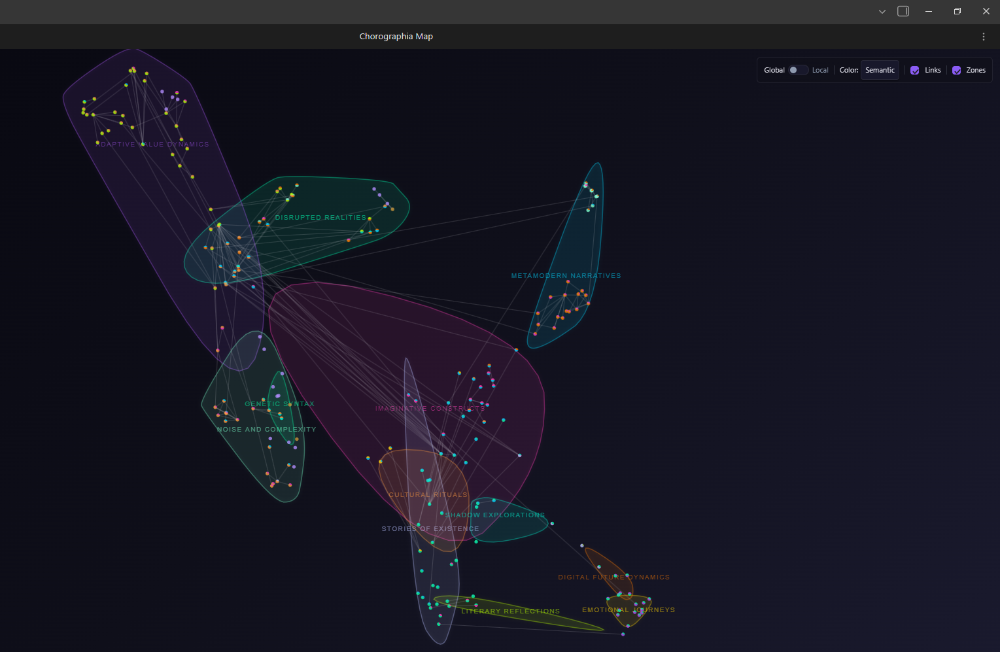
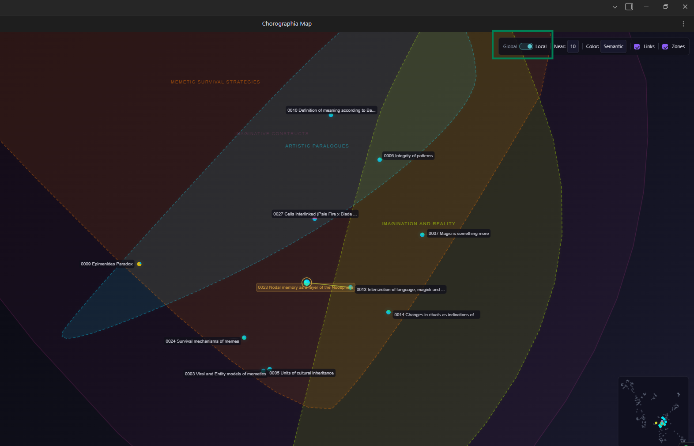
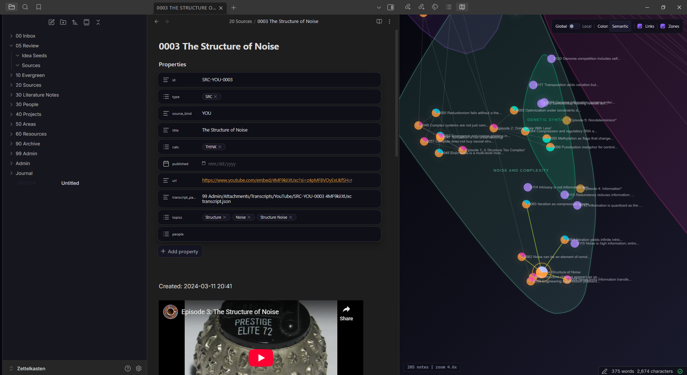
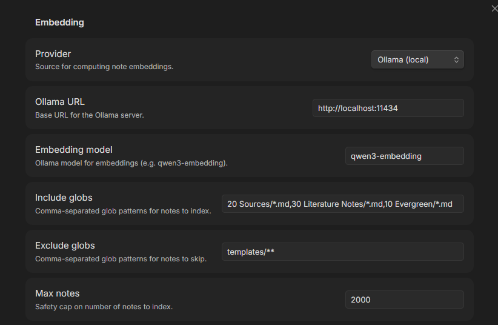
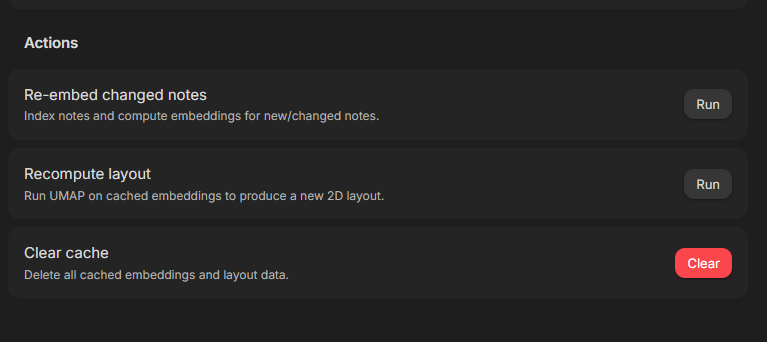

# Chorographia

A semantic map of your Obsidian vault. Your notes become points in space, clustered by meaning.

## What is this?

Chorographia turns your vault into an interactive 2D map. Notes that are semantically similar end up close together — not because they link to each other, but because they're *about* similar things. You can see the shape of your knowledge at a glance: where your clusters of thought are, where the gaps live, and how topics connect.

I built this because I wanted to see my Zettelkasten the way I think about it — as a landscape with regions and neighborhoods, not just a graph of links.

## How it works

The pipeline is simple:

1. **Embed** — Each note gets turned into a high-dimensional vector using an embedding model (Ollama, OpenAI, or imported from Smart Connections)
2. **Project** — UMAP reduces those vectors down to 2D coordinates
3. **Cluster** — K-means groups nearby embeddings into semantic zones
4. **Name** — Optionally, an LLM reads the note titles in each zone and gives it an evocative name

The result is a map you can pan, zoom, and click through.

## Features

**Global view** — See your entire vault at once. Points are colored by semantic cluster, folder, note type, or category. Toggle link edges on to see how your wikilinks trace across the semantic landscape.

**Local view** — Click any note to zoom into its neighborhood. The N nearest neighbors are shown with labels, sub-zones, and a minimap showing where you are on the global map.

**Navigate by clicking** — Clicking a point opens the note and re-centers the local view. You can walk through your vault spatially, discovering notes by proximity rather than by name.

**Semantic zones** — Soft, color-coded regions drawn behind the points using convex hulls with Chaikin subdivision. Each zone gets an auto-label from the most common folder or category, and optionally an LLM-generated name.

**Color modes** — Switch between semantic (frontmatter `sem_k` clusters), folder, note type, or category coloring.

**Link overlay** — Wikilink edges rendered between notes. Hover or select a note to highlight its connections.

**File explorer dots** — Colored circles appear next to notes in Obsidian's file explorer, matching their map color.

**Minimap** — In local view, a corner minimap shows your position in the global layout.

**Mobile support** — Touch gestures for pan and pinch-to-zoom.

## Getting started

### Installation

This plugin isn't in the Obsidian community plugins directory yet. To install manually:

1. Download or clone this repo into your vault's `.obsidian/plugins/chorographia/` directory
2. Run `npm install && npm run build`
3. Enable "Chorographia" in Obsidian's community plugins settings

### First run

1. Open Chorographia settings
2. Choose your embedding provider (Ollama is the default — fully local, no API key needed)
3. Set your include/exclude glob patterns to select which notes to index
4. Click **"Re-embed changed notes"** — this indexes your vault and computes embeddings
5. The layout is computed automatically after the first embedding run
6. Open the map with the ribbon icon or the "Open Chorographia Map" command

## Embedding providers

**Ollama (local)** — Runs entirely on your machine. Point it at your local Ollama server and pick an embedding model (default: `qwen3-embedding`). No data leaves your computer.

**OpenAI** — Uses OpenAI's embedding API. Requires an API key. Good if you want high-quality embeddings without running local models.

**Smart Connections** — Imports embeddings from the Smart Connections plugin. If you already have SC installed and it's generated embeddings, Chorographia can reuse them — no re-embedding needed.

## Settings

## Roadmap / known issues

This is a beta. Things that are rough:

- **Performance** — UMAP runs on the main thread, so layout computation blocks the UI briefly for large vaults. Will move to a web worker eventually.
- **No incremental layout** — Adding a few notes currently requires recomputing the entire UMAP projection. Incremental updates are planned.
- **Zone naming** — LLM naming quality varies. Ollama with smaller models sometimes produces odd names. OpenAI's GPT-4o-mini tends to do better.
- **Community plugins submission** — Plan to submit once the beta is stable and the API surface is settled.

If you hit bugs or have ideas, open an issue.

## License

[MIT](LICENSE)
