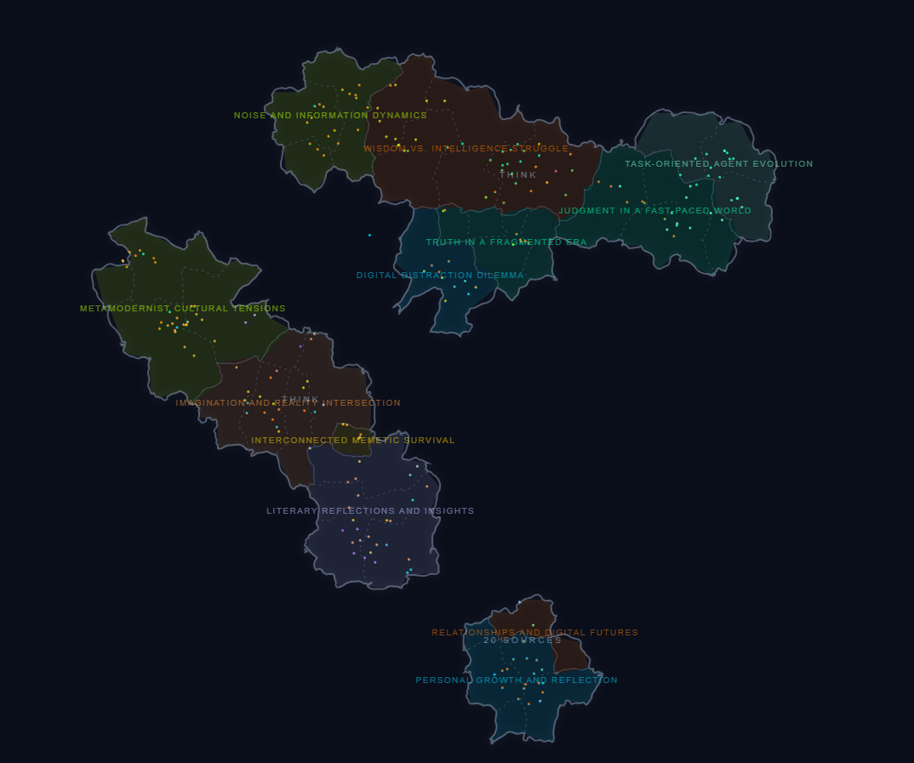
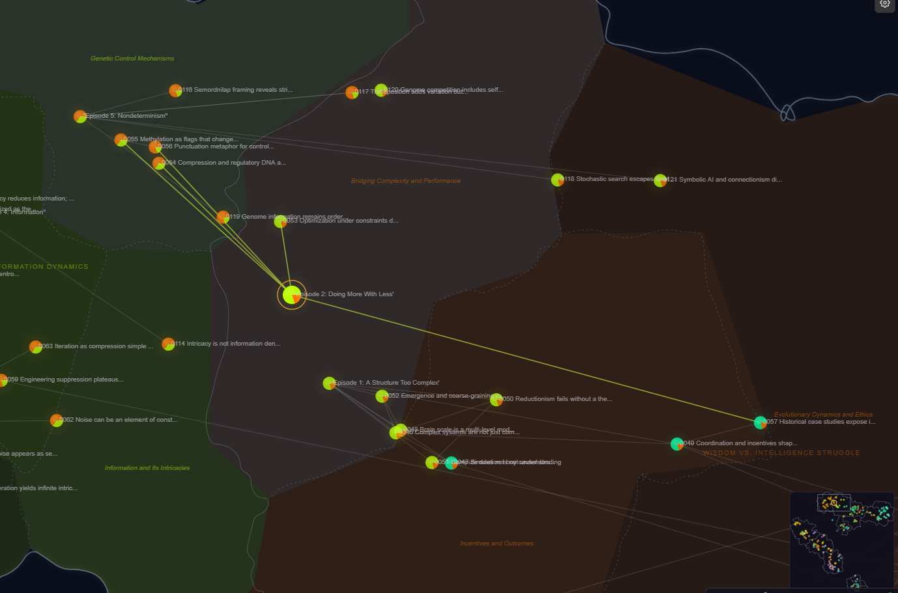

# Chorographia

> **Beta** — Install via [BRAT](https://github.com/TfTHacker/obsidian42-brat) by adding `teleologia/chorographia`.

A semantic map of your Obsidian vault. Your notes become points in space, clustered by meaning.

## What is this?

Chorographia turns your vault into an interactive 2D map. Notes that are semantically similar end up close together — not because they link to each other, but because they're *about* similar things. You can see the shape of your knowledge at a glance: where your clusters of thought are, where the gaps live, and how topics connect.

## How it works

1. **Embed** — Each note gets turned into a high-dimensional vector using an embedding model (Ollama, OpenAI, or OpenRouter)
2. **Project** — UMAP reduces those vectors down to 2D coordinates
3. **Cluster** — K-means groups nearby embeddings into semantic zones
4. **Name** — Optionally, an LLM reads the note titles in each zone and gives it an evocative name

The result is a map you can pan, zoom, and click through.

## Features

**Map styles** — Two rendering modes:
- *Star map* — Overlapping smooth blobs with soft zone boundaries
- *World map* — Non-overlapping country shapes with fractal coastlines, continent grouping, and province sub-divisions

**Semantic zones** — Color-coded regions drawn behind the points using k-means clustering. Each zone gets an auto-label, and optionally an LLM-generated name. Sub-zones (provinces) fade in smoothly as you zoom.

**Pullout menu** — A gear icon in the top-right corner opens a quick-access menu with toggles for:
- **Color mode** — Semantic, folder, type, or category
- **Links** — Show/hide wikilink edges
- **Zones** — Show/hide semantic zone overlays
- **Sub-zones** — Show/hide province sub-divisions
- **Titles** — Show/hide note title labels
- **Minimap** — Off, or choose a corner (TL/TR/BL/BR)

**Navigate by clicking** — Clicking a point opens the note and smoothly re-centers the view. Walk through your vault spatially, discovering notes by proximity rather than by name.

**Link overlay** — Wikilink edges rendered between notes. Hover or select a note to highlight its connections.

**Map lock** — Freeze note positions, cluster assignments, and zone names so the map stays stable as you add new notes. New notes are placed by nearest-neighbor interpolation.

**File explorer dots** — Colored circles appear next to notes in Obsidian's file explorer, matching their map color.

**Minimap** — A corner minimap shows your viewport position when zoomed in, with zone contour outlines for orientation.

**Mobile support** — Touch gestures for pan and pinch-to-zoom.

## Installation

### BRAT (recommended)

1. Install the [BRAT](https://github.com/TfTHacker/obsidian42-brat) plugin
2. In BRAT settings, add `teleologia/chorographia` as a beta plugin
3. Enable "Chorographia" in Obsidian's community plugins settings

### Manual

1. Download `main.js`, `manifest.json`, and `styles.css` from the [latest release](https://github.com/teleologia/chorographia/releases)
2. Place them in your vault's `.obsidian/plugins/chorographia/` directory
3. Enable "Chorographia" in Obsidian's community plugins settings

### First run

1. Open Chorographia settings
2. Choose your embedding provider (Ollama is the default — fully local, no API key needed)
3. Set your include/exclude glob patterns to select which notes to index
4. Click **"Re-embed changed notes"** — this indexes your vault, computes embeddings, and generates the layout
5. Open the map with the ribbon icon or the "Open Chorographia Map" command

## Settings

### Embedding
- **Provider** — Ollama (local), OpenAI, or OpenRouter
- **Model** — Configurable per provider
- **Include/exclude globs** — Control which notes get indexed
- **Max notes** — Safety cap on indexing

### Semantic Zones
- **Show zones** — Toggle zone overlays on the map
- **Zone granularity** — Number of clusters (3–24)
- **Zone style** — Star map or world map
- **Worldmap tuning** — Land density, continental unity, and coast ruggedness sliders
- **LLM zone naming** — Use an LLM to generate evocative names for zones and provinces
- **Lock map** — Preserve positions and labels across re-embeds

### Map Display
- **Color mode** — Semantic, folder, type, or category
- **Show link overlay** — Draw wikilink edges
- **File explorer dots** — Colored dots in the file explorer sidebar
- **Minimap corner** — Off, or choose a corner

## Embedding providers

**Ollama (local)** — Runs entirely on your machine. Point it at your local Ollama server and pick an embedding model (default: `qwen3-embedding`). No data leaves your computer.

**OpenAI** — Uses OpenAI's embedding API. Requires an API key.

**OpenRouter** — Access a variety of embedding models through OpenRouter. Requires an API key from [openrouter.ai](https://openrouter.ai).

## Zone naming providers

When LLM zone naming is enabled, the same three providers are available for generating zone and sub-zone names. The naming provider can be configured independently from the embedding provider.

## Known issues

This is a beta. Things that are rough:

- **Performance** — UMAP runs on the main thread, so layout computation blocks the UI briefly for large vaults
- **No incremental layout** — Adding a few notes currently requires recomputing the entire UMAP projection
- **Zone naming** — LLM naming quality varies by model. Larger models tend to produce better names

If you hit bugs or have ideas, open an issue.

## License

[MIT](LICENSE)
